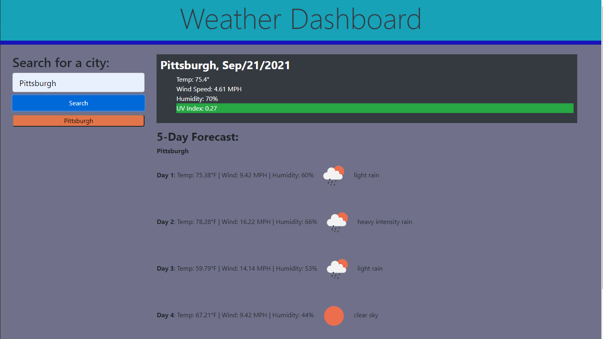

# Weather-Dashboard

## Description

This app was designed to be a weather predictor, showing the daily forecast for a given city including Temperature, Wind Speed, Humidity, and UV Index (with color indicator showing the UV Zone). The app also shows a 5-day forecast for that given city.

## Usage

This app functions simply, using text entry of a city to provide a detailed weather forecast for that day as well as a 5-day forecast. The 5-day forecast shows Temp, Wind, and Humidity as a prediction for the selected city. Icons indicating the weather forecast also appear beside the 5-day forecast items. 

The app is live at this URL: https://lamperouge1218.github.io/Weather-Dashboard/

and here is a screenshot of the final product's intial page: 

## Credits

For this project, I collaborated with [Andrew Currie](https://github.com/curriecoder), [Nicole Pingar](https://github.com/curriecoder), [Molly Singmaster](https://github.com/mollymoo002) and my tutor, Evan Hardek. I also used the sites [W3Schools](https://www.w3schools.com/), [MDN Web Docs](https://developer.mozilla.org/en-US/), [Open Weather API Docs](https://openweathermap.org/api), and [Bootstrap Docs](https://getbootstrap.com/docs/4.5/getting-started/introduction/) for information and specific documentation regarding the API and the styling for the HTML page.  

## License 

MIT License

Copyright (c) [2021] [PhilBohn]

Permission is hereby granted, free of charge, to any person obtaining a copy
of this software and associated documentation files (the "Software"), to deal
in the Software without restriction, including without limitation the rights
to use, copy, modify, merge, publish, distribute, sublicense, and/or sell
copies of the Software, and to permit persons to whom the Software is
furnished to do so, subject to the following conditions:

The above copyright notice and this permission notice shall be included in all
copies or substantial portions of the Software.

THE SOFTWARE IS PROVIDED "AS IS", WITHOUT WARRANTY OF ANY KIND, EXPRESS OR
IMPLIED, INCLUDING BUT NOT LIMITED TO THE WARRANTIES OF MERCHANTABILITY,
FITNESS FOR A PARTICULAR PURPOSE AND NONINFRINGEMENT. IN NO EVENT SHALL THE
AUTHORS OR COPYRIGHT HOLDERS BE LIABLE FOR ANY CLAIM, DAMAGES OR OTHER
LIABILITY, WHETHER IN AN ACTION OF CONTRACT, TORT OR OTHERWISE, ARISING FROM,
OUT OF OR IN CONNECTION WITH THE SOFTWARE OR THE USE OR OTHER DEALINGS IN THE
SOFTWARE.